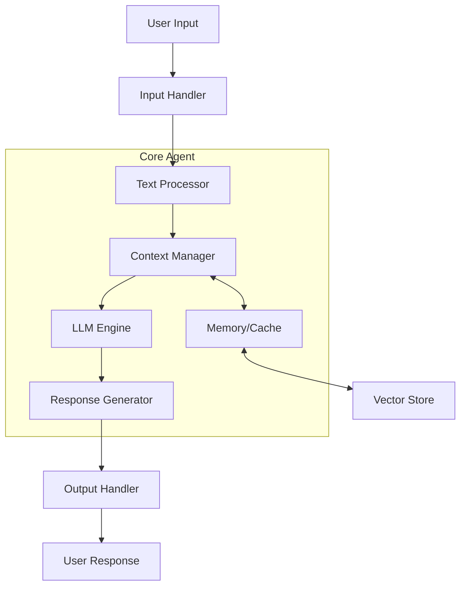
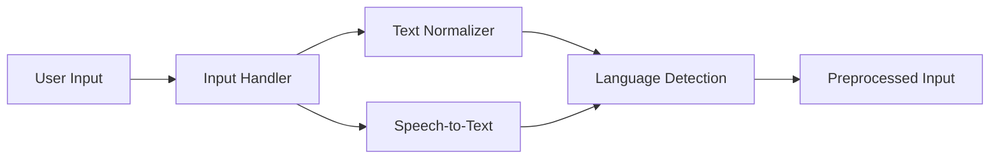
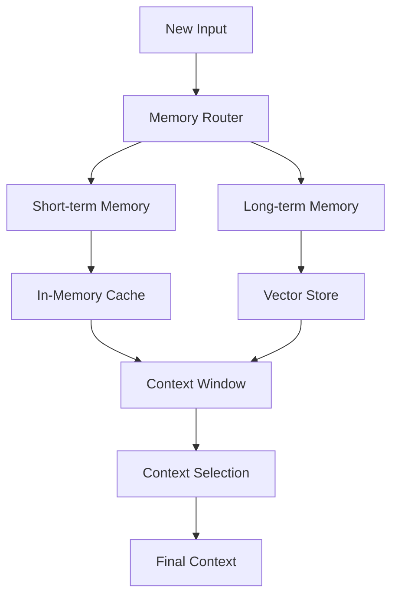
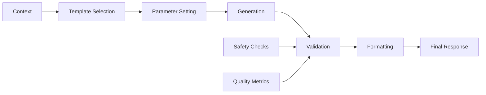
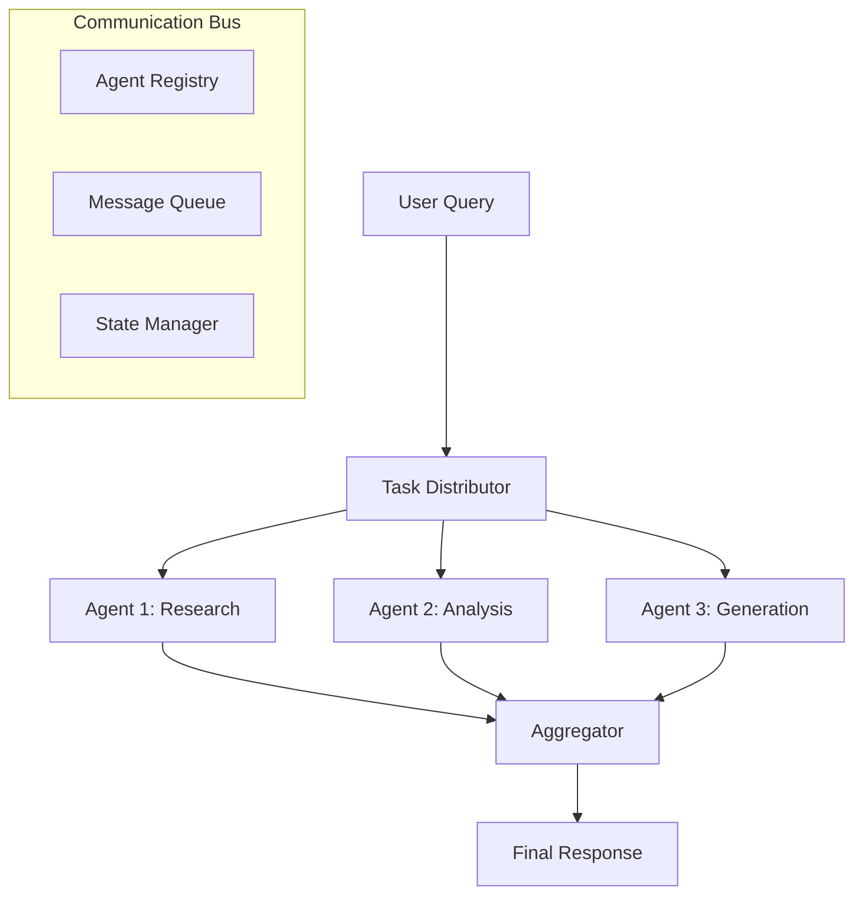
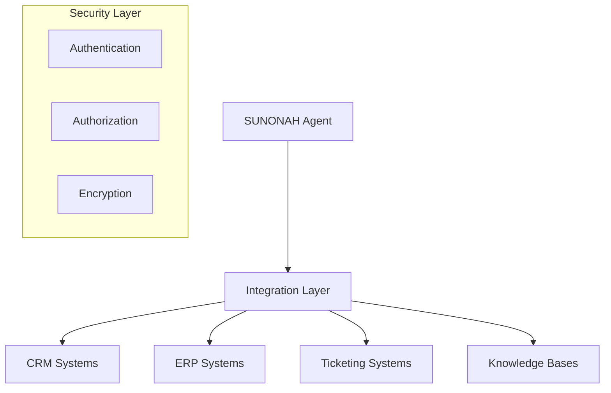

# SUNONAH - AI Assistant Framework

SUNONAH is a versatile conversational AI framework that enables natural voice and text interactions through multiple channels. This guide will help you set up and run the project, even if you're new to programming.

## Table of Contents
- [System Architecture](#system-architecture)
- [Prerequisites](#prerequisites)
- [Installation Guide](#installation-guide)
  - [Basic Setup](#basic-setup)
  - [Advanced Setup (with Telephony)](#advanced-setup-with-telephony)
- [Quick Start Examples](#quick-start-examples)
- [Project Structure](#project-structure)
- [Configuration Guide](#configuration-guide)
- [Troubleshooting](#troubleshooting)

## System Architecture

### Overview


### Input Processing Flow


### Memory Management System


### Response Generation Pipeline


### Multi-Agent Collaboration System


### Enterprise Integration Architecture


These diagrams illustrate the key components and flows of the SUNONAH framework. For more detailed technical information, please refer to the [Architecture Documentation](docs/ARCHITECTURE.md).

## Prerequisites

Before you begin, make sure you have the following installed on your computer:

1. **Python** (version 3.8 or higher)
   - Download from [Python.org](https://www.python.org/downloads/)
   - During installation, check "Add Python to PATH"
   - Verify installation by opening command prompt/terminal and typing:
     ```bash
     python --version
     ```

2. **Git** (for version control)
   - Download from [Git-scm.com](https://git-scm.com/downloads)
   - Verify installation:
     ```bash
     git --version
     ```

3. **Visual Studio Code** (recommended editor)
   - Download from [code.visualstudio.com](https://code.visualstudio.com/)
   - Install Python extension in VS Code

## Installation Guide

### Basic Setup (Text-Only Assistant)

1. **Clone the Repository**
   ```bash
   git clone https://github.com/sap1119/SUNONAH.git
   cd SUNONAH
   ```

2. **Create a Virtual Environment**
   ```bash
   # Windows
   python -m venv venv
   .\venv\Scripts\activate

   # Linux/Mac
   python -m venv venv
   source venv/bin/activate
   ```

3. **Install Dependencies**
   ```bash
   pip install -r requirements.txt
   ```

4. **Set Up Environment Variables**
   - Copy `.env.sample` to `.env`:
     ```bash
     # Windows
     copy .env.sample .env

     # Linux/Mac
     cp .env.sample .env
     ```
   - Edit `.env` file with your API keys (if using OpenAI or other services)

5. **Run Simple Examples**
   ```bash
   # Run the improved chatbot (no API key needed)
   python examples/improved_chatbot.py

   # Run text-only assistant (requires OpenAI API key)
   python examples/text_only_assistant.py
   ```

### Advanced Setup (with Telephony)

1. **Install Docker**
   - Download [Docker Desktop](https://www.docker.com/products/docker-desktop)
   - Install and verify:
     ```bash
     docker --version
     ```

2. **Set Up Telephony Services**
   - Get API credentials from your preferred provider:
     - [Twilio](https://www.twilio.com/)
     - [Plivo](https://www.plivo.com/)
   - Add credentials to your `.env` file

3. **Start Services**
   ```bash
   cd local_setup
   docker-compose up
   ```

## Quick Start Examples

1. **Simple Local Chatbot**
   ```python
   # Run improved_chatbot.py
   python examples/improved_chatbot.py
   ```
   - Type messages and chat with the AI
   - Type 'exit' or 'quit' to end
   - Type 'reset' to clear conversation history

2. **Text-Only Assistant (with OpenAI)**
   ```python
   # First set OPENAI_API_KEY in .env file
   python examples/text_only_assistant.py
   ```

3. **Test Assistant**
   ```python
   python examples/test_assistant.py
   ```

## Project Structure

```
SUNONAH/
├── bolna/              # Core framework code
├── examples/           # Example implementations
├── local_setup/       # Docker and telephony setup
├── .env.sample        # Environment variables template
├── requirements.txt   # Python dependencies
└── README.md         # This file
```

## Configuration Guide

1. **Environment Variables**
   Required for various features:
   ```
   OPENAI_API_KEY=     # Required for OpenAI models
   REDIS_URL=          # Required for telephony setup
   TWILIO_ACCOUNT_SID= # Required for Twilio integration
   TWILIO_AUTH_TOKEN=  # Required for Twilio integration
   ```

2. **Model Configuration**
   - Local Models: No configuration needed
   - OpenAI Models: Requires API key in `.env`

3. **Telephony Setup**
   - Configure provider in `.env`
   - Update Docker settings in `local_setup/`

## Troubleshooting

Common issues and solutions:

1. **Python not found**
   - Ensure Python is in your PATH
   - Try using `python3` instead of `python`

2. **Package Installation Errors**
   - Upgrade pip: `python -m pip install --upgrade pip`
   - Install wheel: `pip install wheel`
   - Try installing requirements one by one

3. **OpenAI API Errors**
   - Verify API key in `.env`
   - Check account credits
   - Try local models instead

4. **Docker Issues**
   - Ensure Docker Desktop is running
   - Check port conflicts
   - Try `docker-compose down` then `up`

## Contributing

1. Fork the repository
2. Create your feature branch
3. Commit your changes
4. Push to the branch
5. Create a Pull Request

## License

This project is licensed under the MIT License - see the [LICENSE](LICENSE) file for details.

## Support

If you encounter any issues:
1. Check the [Troubleshooting](#troubleshooting) section
2. Open an issue on GitHub
3. Provide detailed error messages and steps to reproduce

---

Made with ❤️ by the SUNONAH team