# SUNONAH Agent Architecture

## System Architecture Overview

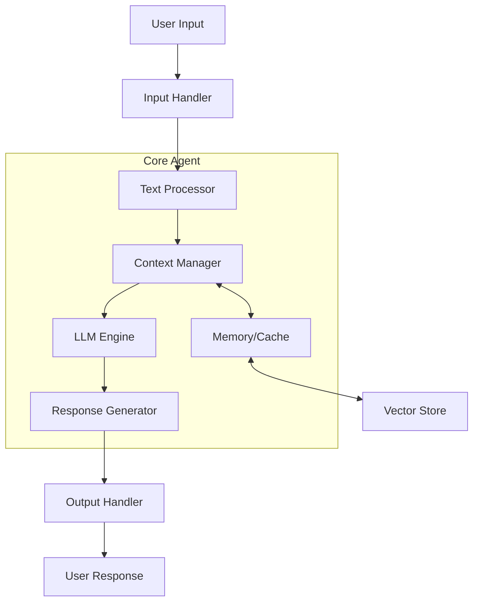

## Detailed Component Flow

### 1. Input Processing Layer
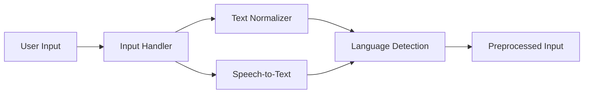

### 2. Context Management Layer
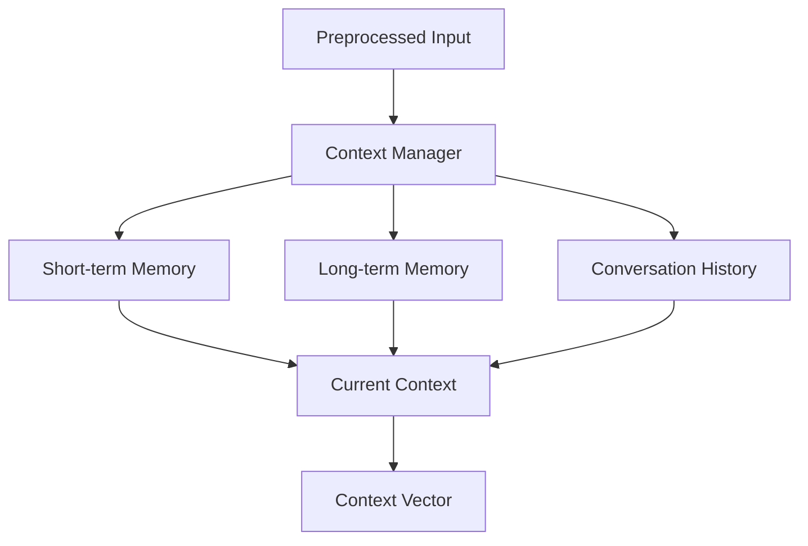

### 3. LLM Processing Layer
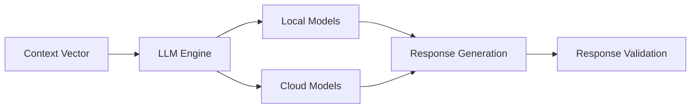

### 4. Output Processing Layer
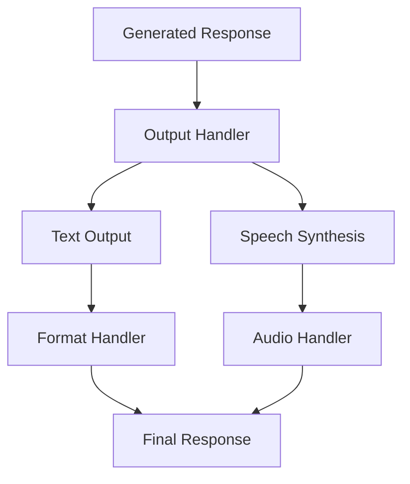

## Component Details

### 1. Input Handler
- **Text Input Processing**
  - Normalizes text
  - Removes special characters
  - Handles multilingual input
- **Speech Input Processing**
  - Speech-to-text conversion
  - Audio quality enhancement
  - Noise reduction

### 2. Context Manager
- **Memory Management**
  - Short-term conversation memory
  - Long-term knowledge base
  - Vector store for semantic search
- **Context Processing**
  - Conversation history tracking
  - Context window management
  - Relevance scoring

### 3. LLM Engine
- **Model Selection**
  - Local models (DialoGPT, etc.)
  - Cloud models (OpenAI, etc.)
  - Model fallback handling
- **Processing Pipeline**
  - Context embedding
  - Response generation
  - Output validation

### 4. Response Generator
- **Response Formatting**
  - Template management
  - Response structuring
  - Multi-turn conversation handling
- **Quality Control**
  - Response validation
  - Content filtering
  - Coherence checking

### 5. Output Handler
- **Text Output**
  - Formatting
  - Localization
  - Style adaptation
- **Speech Output**
  - Text-to-speech synthesis
  - Voice selection
  - Audio processing

## Data Flow Example

1. **User Input Phase**
   ```
   User Input → Text/Speech → Normalization → Language Detection
   ```

2. **Context Processing**
   ```
   Normalized Input → Context Loading → Memory Retrieval → Context Vector
   ```

3. **LLM Processing**
   ```
   Context Vector → Model Selection → Generation → Validation
   ```

4. **Response Delivery**
   ```
   Generated Response → Formatting → Output Channel → User
   ```

## Implementation Guide

### 1. Basic Setup
```python
from sunonah.assistant import Assistant
from sunonah.models import LLMConfig

# Initialize assistant
assistant = Assistant(
    name="example_agent",
    llm_config={
        "provider": "local",
        "model": "dialogpt",
        "temperature": 0.7
    }
)
```

### 2. Adding Capabilities
```python
# Add conversation task
assistant.add_task(
    task_type="conversation",
    enable_textual_input=True,
    enable_voice_input=False
)

# Configure memory
assistant.configure_memory(
    short_term_limit=10,  # Last 10 exchanges
    long_term_storage=True
)
```

### 3. Running the Assistant
```python
async def main():
    # Start conversation
    async for response in assistant.chat("Hello!"):
        print(response)

    # Stream results
    async for _, chunk in assistant.execute():
        print(chunk)
```

## Best Practices

1. **Input Handling**
   - Always validate input format
   - Handle multiple input types gracefully
   - Implement proper error handling

2. **Context Management**
   - Regularly clean up old contexts
   - Implement context prioritization
   - Use efficient storage methods

3. **Model Usage**
   - Implement model fallbacks
   - Monitor token usage
   - Cache frequent responses

4. **Output Processing**
   - Validate response quality
   - Handle multiple output formats
   - Implement rate limiting

## Error Handling

1. **Input Errors**
   ```python
   try:
       processed_input = input_handler.process(user_input)
   except InputFormatError:
       return error_handler.handle_input_error()
   ```

2. **Model Errors**
   ```python
   try:
       response = await llm_engine.generate(context)
   except ModelError:
       response = await fallback_model.generate(context)
   ```

3. **Context Errors**
   ```python
   try:
       context = context_manager.get_context()
   except ContextNotFoundError:
       context = context_manager.create_new_context()
   ```

## Performance Optimization

1. **Memory Management**
   - Use vector stores for efficient retrieval
   - Implement caching for frequent queries
   - Regular cleanup of old contexts

2. **Model Selection**
   - Dynamic model selection based on input
   - Load balancing between local and cloud models
   - Efficient token usage

3. **Response Optimization**
   - Response caching
   - Batch processing where applicable
   - Asynchronous operations

## Detailed Implementation Examples

### 1. Custom Input Handler Implementation
```python
from sunonah.input_handlers import BaseInputHandler
from sunonah.models import InputConfig

class CustomInputHandler(BaseInputHandler):
    def __init__(self, config: InputConfig):
        super().__init__(config)
        self.preprocessors = []
        
    async def process_text(self, text: str) -> str:
        # Custom text preprocessing
        normalized = text.lower().strip()
        
        # Apply custom filters
        for preprocessor in self.preprocessors:
            normalized = await preprocessor(normalized)
            
        return normalized
        
    async def validate_input(self, text: str) -> bool:
        # Custom validation logic
        if not text or len(text.strip()) == 0:
            raise ValueError("Empty input")
        if len(text) > self.config.max_length:
            raise ValueError("Input too long")
        return True

# Usage Example
config = InputConfig(max_length=1000, language="en")
handler = CustomInputHandler(config)
```

### 2. Context Management with Vector Store
```python
from sunonah.memory import VectorStore
from sunonah.models import ContextConfig

class AdvancedContextManager:
    def __init__(self, config: ContextConfig):
        self.vector_store = VectorStore()
        self.config = config
        self.current_context = []
        
    async def add_to_context(self, message: str):
        # Embed and store message
        embedding = await self.vector_store.embed(message)
        self.vector_store.store(embedding)
        
        # Update current context
        self.current_context.append({
            'text': message,
            'timestamp': time.time(),
            'embedding': embedding
        })
        
        # Maintain context window
        if len(self.current_context) > self.config.max_context:
            self.current_context.pop(0)
            
    async def get_relevant_context(self, query: str) -> list:
        # Get similar contexts
        query_embedding = await self.vector_store.embed(query)
        similar = self.vector_store.search(
            query_embedding,
            k=self.config.max_results
        )
        return similar

# Usage Example
config = ContextConfig(max_context=10, max_results=3)
context_manager = AdvancedContextManager(config)
```

### 3. Advanced Response Generation
```python
from sunonah.models import ResponseConfig
from sunonah.llms import LLMEngine

class AdvancedResponseGenerator:
    def __init__(self, config: ResponseConfig):
        self.config = config
        self.llm_engine = LLMEngine()
        self.fallback_responses = []
        
    async def generate_response(self, 
                              context: str,
                              max_retries: int = 3) -> str:
        for attempt in range(max_retries):
            try:
                # Generate primary response
                response = await self.llm_engine.generate(
                    context,
                    temperature=self.config.temperature,
                    max_tokens=self.config.max_tokens
                )
                
                # Validate response
                if await self.validate_response(response):
                    return response
                    
            except Exception as e:
                print(f"Attempt {attempt + 1} failed: {str(e)}")
                
        # Fallback if all attempts fail
        return self.get_fallback_response()
        
    async def validate_response(self, response: str) -> bool:
        # Length check
        if len(response) < self.config.min_length:
            return False
            
        # Content check
        if not self.check_content_safety(response):
            return False
            
        return True

# Usage Example
config = ResponseConfig(
    temperature=0.7,
    max_tokens=100,
    min_length=10
)
generator = AdvancedResponseGenerator(config)
```

## Additional Component Diagrams

### 1. Vector Store Architecture
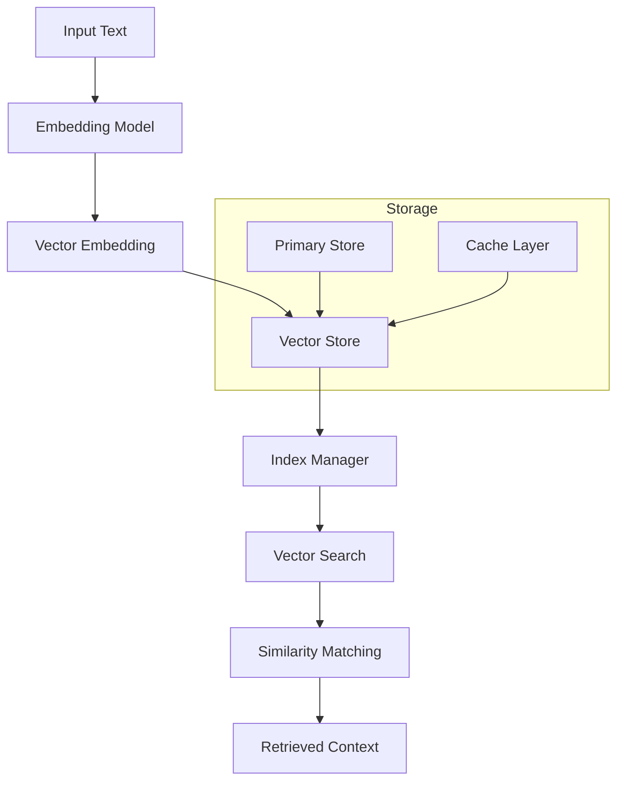

### 2. Response Generation Pipeline
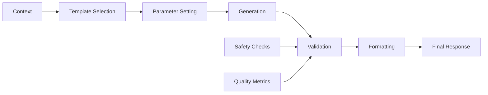

### 3. Memory Management System
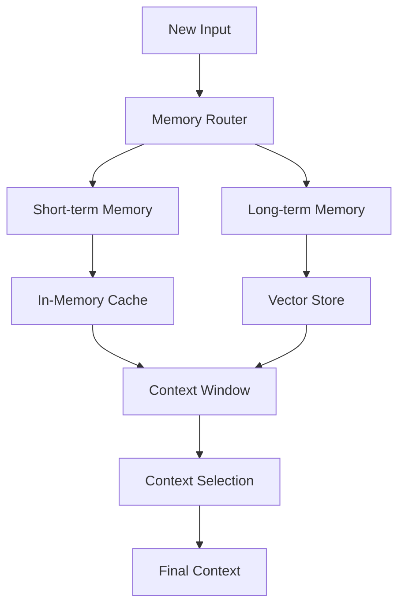

## Specific Use Cases

### 1. Customer Service Bot
```python
# Initialize specialized customer service assistant
customer_service = Assistant(
    name="customer_support",
    llm_config={
        "provider": "local",
        "model": "dialogpt",
        "temperature": 0.5,
        "context_window": 5
    }
)

# Add specialized knowledge base
customer_service.add_knowledge_base(
    documents=[
        "FAQ.md",
        "product_info.json",
        "support_guidelines.txt"
    ],
    index_type="semantic"
)

# Configure response templates
customer_service.add_response_templates({
    "greeting": "Welcome to {company} support! How can I help you today?",
    "farewell": "Thank you for contacting {company} support. Is there anything else I can help you with?",
    "escalation": "I'll connect you with a human agent. Please hold."
})

# Run the assistant
async def handle_customer():
    async for response in customer_service.chat():
        if response.needs_escalation:
            await escalate_to_human()
        else:
            await send_response(response)
```

### 2. Meeting Summarizer
```python
# Initialize meeting summarizer
meeting_assistant = Assistant(
    name="meeting_summarizer",
    llm_config={
        "provider": "openai",
        "model": "gpt-4",
        "temperature": 0.3
    }
)

# Configure summarization task
meeting_assistant.add_task(
    task_type="summarization",
    config={
        "format": "bullet_points",
        "max_length": 500,
        "key_points": True,
        "action_items": True
    }
)

# Process meeting transcript
async def summarize_meeting(transcript: str):
    summary = await meeting_assistant.summarize(
        text=transcript,
        metadata={
            "meeting_type": "weekly_standup",
            "participants": ["Alice", "Bob", "Charlie"],
            "date": "2025-11-04"
        }
    )
    return summary.get_formatted()
```

### 3. Multi-Modal Assistant
```python
# Initialize multi-modal assistant
multimodal_assistant = Assistant(
    name="multi_modal",
    llm_config={
        "provider": "local",
        "model": "dialogpt",
        "temperature": 0.7
    }
)

# Configure multiple input/output handlers
multimodal_assistant.configure_io(
    input_handlers=[
        TextInputHandler(),
        VoiceInputHandler(model="whisper"),
        ImageInputHandler(model="clip")
    ],
    output_handlers=[
        TextOutputHandler(),
        SpeechOutputHandler(voice="en-US-Neural2-F"),
        ImageOutputHandler()
    ]
)

# Process multi-modal input
async def process_input(input_data: dict):
    if input_data.get("voice"):
        text = await multimodal_assistant.transcribe(
            input_data["voice"]
        )
    elif input_data.get("image"):
        text = await multimodal_assistant.describe_image(
            input_data["image"]
        )
    else:
        text = input_data.get("text", "")
        
    response = await multimodal_assistant.generate_response(
        text,
        output_format=input_data.get("preferred_format", "text")
    )
    return response

## Future Features and Implementation Scope

### 1. Advanced AI Features

#### A. Multi-Agent Collaboration System
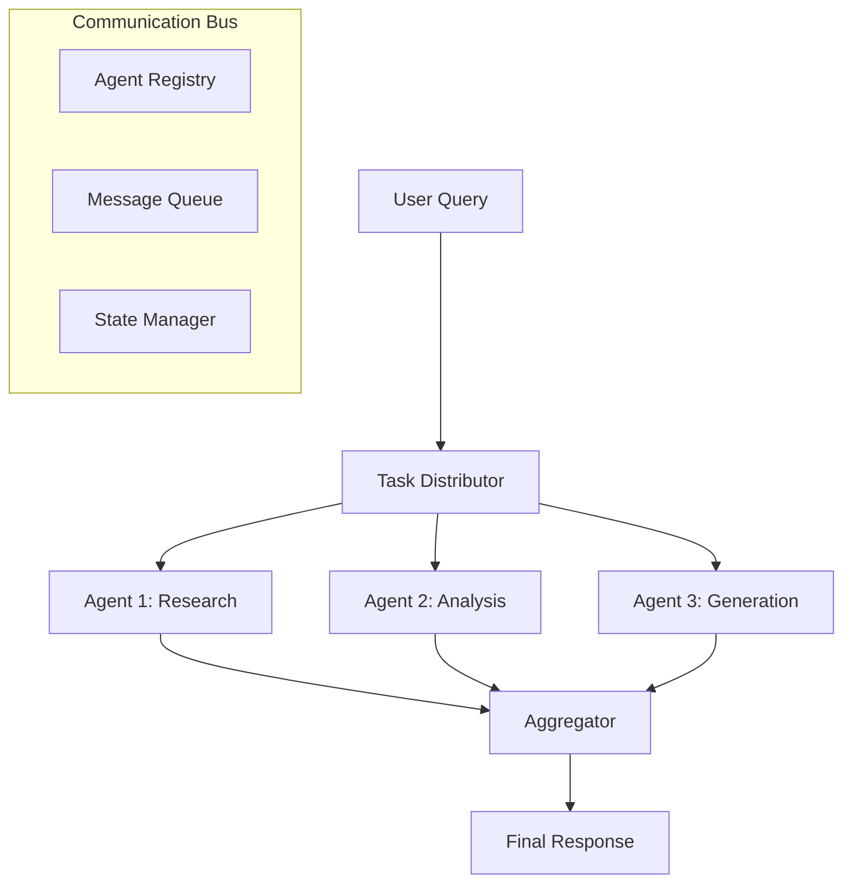

**Implementation Approach:**
```python
# Future multi-agent system
class AgentNetwork:
    def __init__(self):
        self.agents = {}
        self.message_bus = MessageBus()
        self.task_router = TaskRouter()

    async def distribute_task(self, task: Task):
        # Automatic task distribution
        suitable_agents = self.task_router.find_agents(task)
        results = await asyncio.gather(*[
            agent.process(task.subset())
            for agent in suitable_agents
        ])
        return self.aggregate_results(results)
```

#### B. Advanced Reasoning Engine
- Causal reasoning
- Analogical reasoning
- Temporal reasoning
- Spatial reasoning

### 2. No-Code Implementation Examples

#### A. Visual Flow Builder
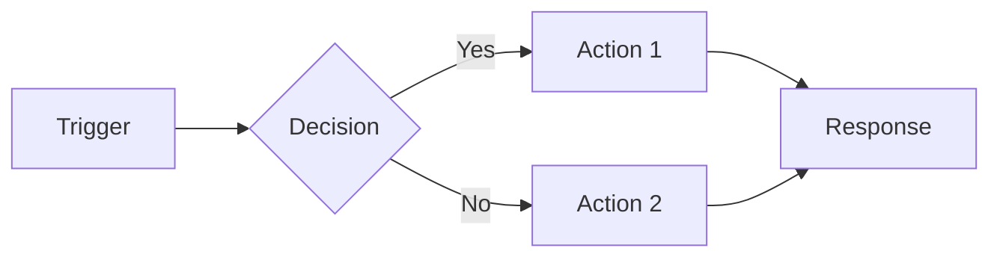

**Configuration JSON:**
```json
{
    "flow": {
        "name": "Customer Support Flow",
        "triggers": [{
            "type": "message_received",
            "channel": "chat"
        }],
        "nodes": [
            {
                "id": "intent_check",
                "type": "decision",
                "model": "intent_classifier",
                "outputs": {
                    "support": "support_flow",
                    "sales": "sales_flow",
                    "default": "general_response"
                }
            },
            {
                "id": "support_flow",
                "type": "process",
                "actions": [
                    {"type": "fetch_kb", "category": "support"},
                    {"type": "generate_response", "template": "support"}
                ]
            }
        ]
    }
}
```

#### B. Drag-and-Drop Agent Builder
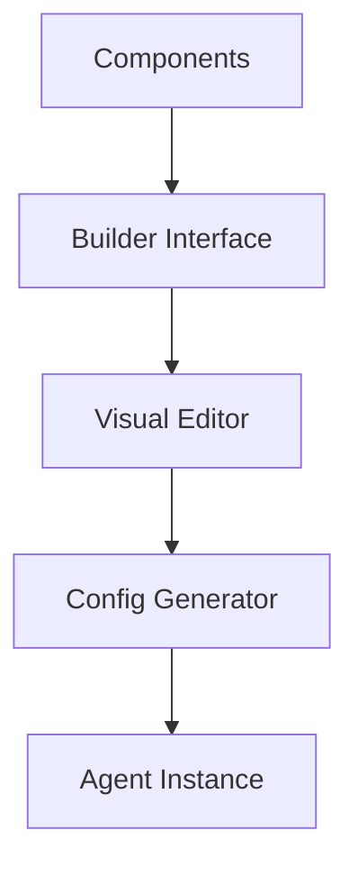

**Example Configuration:**
```yaml
agent:
  name: Custom Assistant
  components:
    input:
      - type: text
      - type: voice
        model: whisper
    processing:
      - type: intent_classifier
      - type: knowledge_base
        source: docs/*
    output:
      - type: text
      - type: voice
        voice_id: en-US-Neural2-F
  flows:
    - name: main_flow
      steps:
        - input_processing
        - intent_classification
        - knowledge_lookup
        - response_generation
```

### 3. Low-Code Implementation Patterns

#### A. Component-Based Assembly
```python
# Low-code component assembly
@agent_builder
class CustomAgent:
    @input_handler
    def process_input(self, input_data):
        return normalize(input_data)
    
    @intent_classifier
    def classify_intent(self, text):
        return get_intent(text)
    
    @response_generator
    def generate_response(self, context):
        return create_response(context)

# Usage
agent = CustomAgent.build(config="agent_config.yaml")
```

#### B. Pipeline Constructor
```python
# Simple pipeline construction
pipeline = (
    InputProcessor()
    >> IntentClassifier()
    >> ContextManager()
    >> ResponseGenerator()
    >> OutputFormatter()
)

# Configuration through decorators
@pipeline_config(model="gpt-4")
@with_memory(type="vector_store")
@with_analytics
class SupportAgent(BaseAgent):
    def process(self, input_data):
        return pipeline.run(input_data)
```

### 4. Future-Ready Features

#### A. Autonomous Learning System
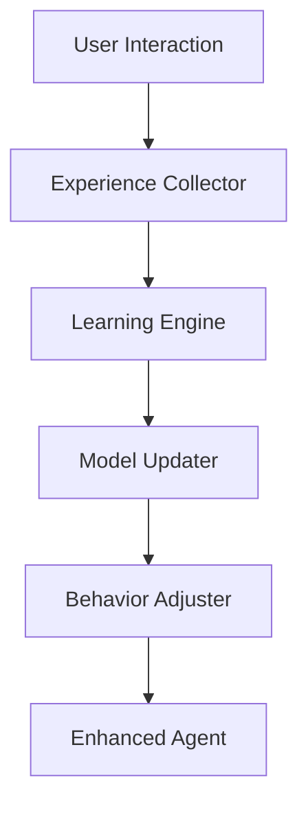

**Implementation Preview:**
```python
class SelfImprovingAgent:
    def __init__(self):
        self.experience_buffer = ExperienceBuffer()
        self.learning_engine = LearningEngine()
        self.model = AdaptiveModel()

    async def learn_from_interaction(self, interaction: Interaction):
        # Collect experience
        self.experience_buffer.add(interaction)
        
        # Trigger learning if enough data
        if self.experience_buffer.is_ready_for_learning():
            improvements = await self.learning_engine.analyze(
                self.experience_buffer.get_recent()
            )
            
            # Apply improvements
            self.model.update(improvements)
            
            # Verify improvements
            performance = await self.evaluate_improvements()
            if performance.is_better():
                self.commit_changes()
            else:
                self.rollback()
```

#### B. Dynamic Knowledge Integration
```python
class KnowledgeIntegrator:
    def __init__(self):
        self.knowledge_base = DynamicKnowledgeBase()
        self.verifier = FactVerifier()
        
    async def integrate_new_knowledge(self, source: str):
        # Extract knowledge
        new_facts = await self.extract_facts(source)
        
        # Verify and validate
        verified_facts = await self.verifier.verify_all(new_facts)
        
        # Integrate with existing knowledge
        conflicts = self.knowledge_base.find_conflicts(verified_facts)
        if conflicts:
            resolved = await self.resolve_conflicts(conflicts)
            self.knowledge_base.update(resolved)
        else:
            self.knowledge_base.add(verified_facts)
```

#### C. Ethical AI Framework
```python
class EthicalAIFramework:
    def __init__(self):
        self.ethical_principles = load_ethical_guidelines()
        self.bias_detector = BiasDetector()
        self.fairness_checker = FairnessChecker()
        
    async def ensure_ethical_response(self, response: str):
        # Check for bias
        bias_report = await self.bias_detector.analyze(response)
        if bias_report.has_bias():
            response = await self.debias(response)
            
        # Ensure fairness
        fairness_score = await self.fairness_checker.evaluate(response)
        if not fairness_score.is_acceptable():
            response = await self.adjust_for_fairness(response)
            
        # Verify against ethical principles
        compliance = self.verify_ethical_compliance(response)
        if not compliance.is_compliant():
            response = await self.make_compliant(response)
            
        return response
```

### 5. Integration Capabilities

#### A. Enterprise System Integration
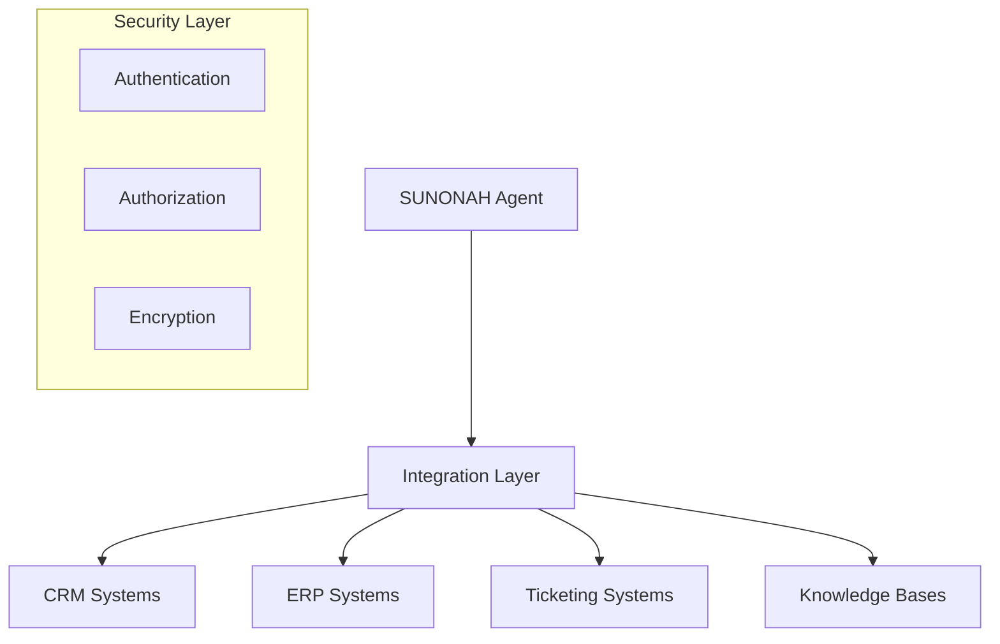

#### B. API-First Architecture
```python
class EnterpriseConnector:
    def __init__(self):
        self.integrations = {}
        self.security = SecurityLayer()
        
    async def connect_system(self, system_type: str, config: dict):
        # Validate and create connection
        connector = await self.create_connector(system_type, config)
        await self.verify_connection(connector)
        self.integrations[system_type] = connector
        
    async def query_system(self, system_type: str, query: dict):
        # Execute authenticated query
        connector = self.integrations.get(system_type)
        if not connector:
            raise IntegrationError(f"System {system_type} not connected")
            
        token = await self.security.get_token()
        return await connector.execute_query(query, token)
```

### 6. Deployment Patterns

#### A. Serverless Architecture
```yaml
functions:
  agent_handler:
    handler: handler.process_request
    events:
      - http:
          path: /chat
          method: post
      - websocket:
          route: $connect
    environment:
      MODEL_ENDPOINT: ${self:custom.modelEndpoint}
      VECTOR_STORE: ${self:custom.vectorStore}
```

#### B. Kubernetes Deployment
```yaml
apiVersion: apps/v1
kind: Deployment
metadata:
  name: sunonah-agent
spec:
  replicas: 3
  selector:
    matchLabels:
      app: sunonah
  template:
    metadata:
      labels:
        app: sunonah
    spec:
      containers:
      - name: agent
        image: sunonah/agent:latest
        resources:
          limits:
            memory: "2Gi"
            cpu: "1"
        env:
        - name: MODEL_ENDPOINT
          valueFrom:
            configMapKeyRef:
              name: agent-config
              key: model-endpoint
