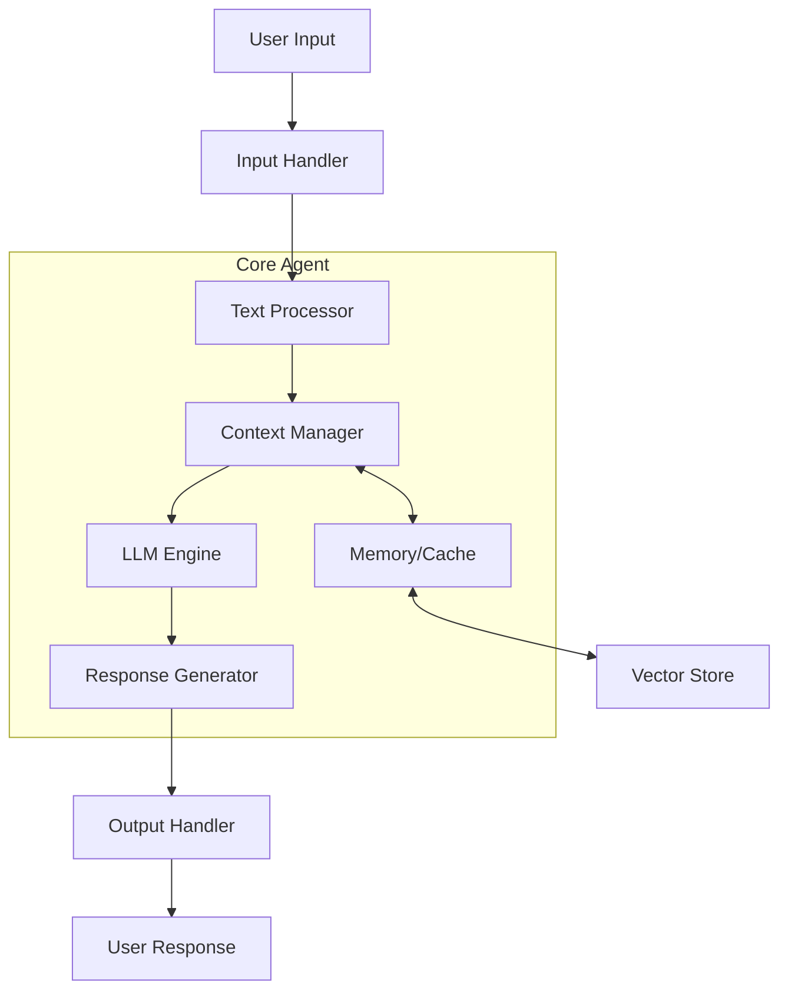
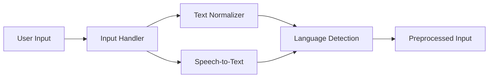
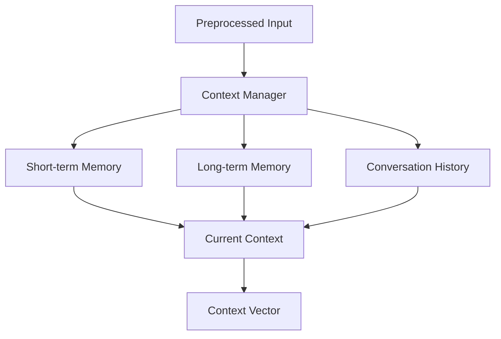
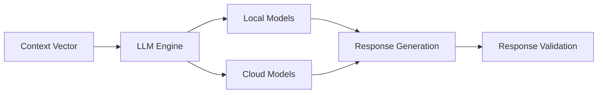
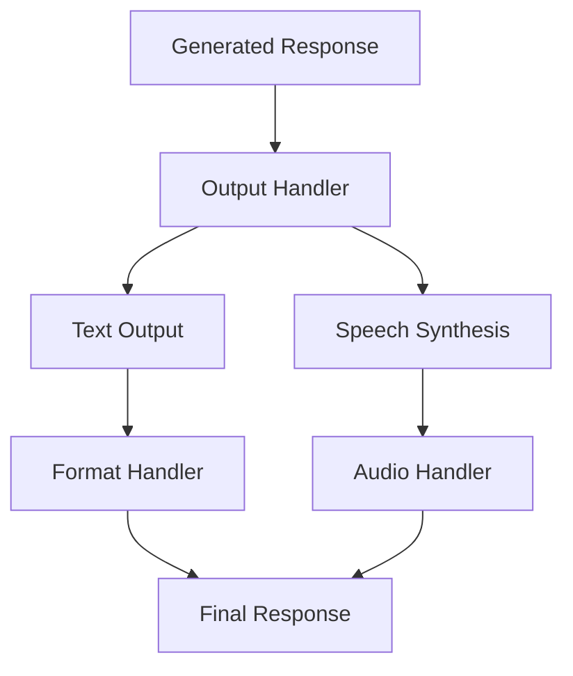

# SUNONAH Agent Architecture

## System Architecture Overview



## Detailed Component Flow

### 1. Input Processing Layer


### 2. Context Management Layer


### 3. LLM Processing Layer


### 4. Output Processing Layer


## Component Details

### 1. Input Handler
- **Text Input Processing**
  - Normalizes text
  - Removes special characters
  - Handles multilingual input
- **Speech Input Processing**
  - Speech-to-text conversion
  - Audio quality enhancement
  - Noise reduction

### 2. Context Manager
- **Memory Management**
  - Short-term conversation memory
  - Long-term knowledge base
  - Vector store for semantic search
- **Context Processing**
  - Conversation history tracking
  - Context window management
  - Relevance scoring

### 3. LLM Engine
- **Model Selection**
  - Local models (DialoGPT, etc.)
  - Cloud models (OpenAI, etc.)
  - Model fallback handling
- **Processing Pipeline**
  - Context embedding
  - Response generation
  - Output validation

### 4. Response Generator
- **Response Formatting**
  - Template management
  - Response structuring
  - Multi-turn conversation handling
- **Quality Control**
  - Response validation
  - Content filtering
  - Coherence checking

### 5. Output Handler
- **Text Output**
  - Formatting
  - Localization
  - Style adaptation
- **Speech Output**
  - Text-to-speech synthesis
  - Voice selection
  - Audio processing

## Data Flow Example

1. **User Input Phase**
   ```
   User Input → Text/Speech → Normalization → Language Detection
   ```

2. **Context Processing**
   ```
   Normalized Input → Context Loading → Memory Retrieval → Context Vector
   ```

3. **LLM Processing**
   ```
   Context Vector → Model Selection → Generation → Validation
   ```

4. **Response Delivery**
   ```
   Generated Response → Formatting → Output Channel → User
   ```

## Implementation Guide

### 1. Basic Setup
```python
from sunonah.assistant import Assistant
from sunonah.models import LLMConfig

# Initialize assistant
assistant = Assistant(
    name="example_agent",
    llm_config={
        "provider": "local",
        "model": "dialogpt",
        "temperature": 0.7
    }
)
```

### 2. Adding Capabilities
```python
# Add conversation task
assistant.add_task(
    task_type="conversation",
    enable_textual_input=True,
    enable_voice_input=False
)

# Configure memory
assistant.configure_memory(
    short_term_limit=10,  # Last 10 exchanges
    long_term_storage=True
)
```

### 3. Running the Assistant
```python
async def main():
    # Start conversation
    async for response in assistant.chat("Hello!"):
        print(response)

    # Stream results
    async for _, chunk in assistant.execute():
        print(chunk)
```

## Best Practices

1. **Input Handling**
   - Always validate input format
   - Handle multiple input types gracefully
   - Implement proper error handling

2. **Context Management**
   - Regularly clean up old contexts
   - Implement context prioritization
   - Use efficient storage methods

3. **Model Usage**
   - Implement model fallbacks
   - Monitor token usage
   - Cache frequent responses

4. **Output Processing**
   - Validate response quality
   - Handle multiple output formats
   - Implement rate limiting

## Error Handling

1. **Input Errors**
   ```python
   try:
       processed_input = input_handler.process(user_input)
   except InputFormatError:
       return error_handler.handle_input_error()
   ```

2. **Model Errors**
   ```python
   try:
       response = await llm_engine.generate(context)
   except ModelError:
       response = await fallback_model.generate(context)
   ```

3. **Context Errors**
   ```python
   try:
       context = context_manager.get_context()
   except ContextNotFoundError:
       context = context_manager.create_new_context()
   ```

## Performance Optimization

1. **Memory Management**
   - Use vector stores for efficient retrieval
   - Implement caching for frequent queries
   - Regular cleanup of old contexts

2. **Model Selection**
   - Dynamic model selection based on input
   - Load balancing between local and cloud models
   - Efficient token usage

3. **Response Optimization**
   - Response caching
   - Batch processing where applicable
   - Asynchronous operations
